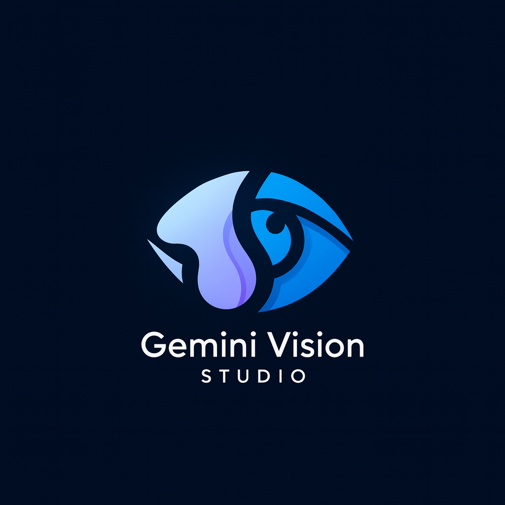

# Gemini Vision Studio

[](https://opensource.org/licenses/Apache-2.0)

Gemini Vision Studio is an advanced web application that showcases the power of a multi-agent workflow for sophisticated image generation. It transforms simple user ideas into high-quality, polished visuals by first orchestrating AI agents to craft a perfect prompt, and then using that prompt to generate stunning images with the Google Gemini API.



## Key Features

- **Advanced Multi-Agent Workflow:** Utilizes a "Planner" agent to deconstruct a user's brief and a "Writer" agent to craft a detailed, one-shot prompt for superior image quality.
- **Multiple Generation Contexts:** Specialized agents handle a variety of tasks:
    - **Default:** Standard text-to-image generation.
    - **Sketch/Photo Transformation:** Converts rough sketches or reference photos into detailed renderings.
    - **Floor Plan Visualization:** Creates realistic visualizations from architectural floor plans.
    - **Image Editing (Inpainting):** Edit specific parts of an image using an intuitive, built-in mask editor.
    - **Related Scene Generation:** Expands on an existing image by creating new, spatially consistent scenes.
    - **Background Compositing:** Adds new elements to a background image while preserving perspective and lighting.
- **Flexible Image Inputs:** Supports multiple image inputs simultaneously, including a base image (sketch, photo, plan), background, style references, and an image to edit.
- **Versatile Output Modes:**
    - **Prompt & Images:** The full, two-stage workflow for the best quality.
    - **Prompt Only:** A powerful tool for prompt engineering and learning.
    - **Image Only (Fast):** Bypasses the agent workflow for direct, rapid image generation.
- **Modern User Experience:**
    - Clean, responsive, and intuitive dark-mode interface.
    - Session persistence with IndexedDB—never lose your work on a page refresh.
    - Interactive image gallery with fullscreen view and download options.
    - Client-side validation and state management.

## How It Works: The Multi-Agent Workflow

The core innovation of Gemini Vision Studio is its two-stage, multi-agent process that turns a simple brief into a rich, detailed prompt. This avoids the trial-and-error often associated with prompt engineering.

1.  **The "Planner" Agent (`gemini-2.5-flash`)**
    - **Input:** The user's brief (e.g., "A modern house in the forest") and any uploaded images.
    - **Task:** Analyzes the request and creates a high-level, conceptual checklist outlining the key components and steps needed to create the image.
    - **Output:** A markdown checklist (e.g., `- Design a modern architectural style. - Set the scene in a dense, misty forest. - Use morning light to create long shadows...`).

2.  **The "Writer" Agent (`gemini-2.5-flash`)**
    - **Input:** The original user brief, the images, and the **Plan** from the Planner agent.
    - **Task:** Executes the plan by writing a comprehensive, one-shot narrative prompt. It uses specialized knowledge for different contexts (like architecture or inpainting) and incorporates details from reference images.
    - **Output:** A final, high-quality prompt, along with a list of assumptions made and clarifying questions for the user.

3.  **The "Image" Model (`gemini-2.5-flash-image`)**
    - **Input:** The final one-shot prompt from the Writer and all relevant images.
    - **Task:** Generates the final, high-resolution images.

This structured approach consistently produces superior results compared to using a direct, simple prompt.

## Technology Stack

- **Frontend:** React, TypeScript, Tailwind CSS
- **AI/ML:** Google Gemini API (`@google/genai` SDK)
  - **Models:** `gemini-2.5-flash` for agentic logic and `gemini-2.5-flash-image` for image generation.
- **Storage:** IndexedDB for client-side session persistence.
- **Tooling:** Vite/esbuild (via the development environment).

## Getting Started

To run this project locally, you will need a Google Gemini API key.

1.  **Clone the repository:**
    ```bash
    git clone https://github.com/your-username/gemini-vision-studio.git
    cd gemini-vision-studio
    ```

2.  **Set up your API Key:**
    The application is configured to load the Gemini API key from the `process.env.API_KEY` environment variable. You will need to make this available to your local development server. A common way is to use a tool like `dotenv` or set it directly in your shell.

3.  **Install Dependencies and Run:**
    This project is set up as a static site. You don't need a complex build process. You can serve the files with any simple HTTP server.

    ```bash
    # Use a simple static server like 'serve'
    npx serve
    ```
    The application will be available at `http://localhost:3000` (or the port specified by the `serve` command).

## Usage

1.  **Enter a Brief:** Start by writing a description of the image you want to create in the main text area.
2.  **(Optional) Provide Images:**
    - **Background:** Upload an image to serve as a static background.
    - **Image to Edit:** Upload an image to inpaint. Use the built-in editor to mask the area you want to change and provide a specific brief for the masked area.
    - **Base Image:** Provide a sketch, photo, or floor plan to be transformed.
    - **Image Cues:** Upload up to three images to be used as style and content references.
3.  **Choose Output:**
    - **Prompt & Images:** Get the best results with the full agent workflow.
    - **Prompt Only:** See the detailed prompt the agents create without generating images.
    - **Image Only:** Generate images directly from your brief for faster results.
4.  **Generate:** Adjust the number of images you want and click the "Generate" button.
5.  **View Results:** The generated prompt (if applicable) and images will appear below. You can click on any image to view it in a larger modal or download it.

## License

This project is licensed under the Apache License, Version 2.0. See the [LICENSE](http://www.apache.org/licenses/LICENSE-2.0) file for details.
