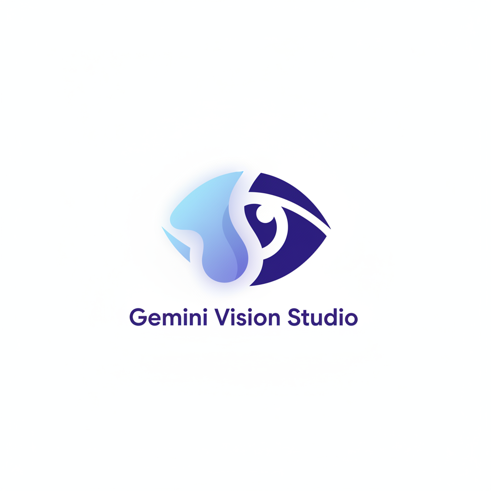

# Gemini Vision Studio

Turn simple ideas into professionally prompted visuals with a multi-agent AI workflow.

Gemini Vision Studio is a web app that runs a two-stage image generation process. Specialized agents on the Google Gemini API first convert a user brief into a precise one-shot prompt, then use that prompt to generate high-quality images.

---

## ✨ Core Features

* **🧠 Multi-Agent Workflow**
  Planner agent deconstructs requests. Writer agent crafts expert prompts for consistent, higher-quality outputs.

* **🎨 Multiple Generation Modes**

  * **Prompt & Images:** End-to-end from brief to final images
  * **Prompt Only:** Prompt engineering and refinement
  * **Image Only (Fast):** Direct, quick generation from a brief

* **🖼️ Rich Image Inputs**

  * **Image to Edit:** Upload an image and describe changes
  * **In-Browser Masking:** Draw masks to inpaint or edit exact areas
  * **Base Images:** Transform sketches, photos, or floor plans
  * **Backgrounds:** Composite new elements with matched lighting and perspective
  * **Related Scenes:** Generate logical extensions or new viewpoints
  * **Image Cues:** Up to three reference images for style and content

* **🤖 Context-Aware Agents**
  Dedicated writers for inpainting, floor plans, background compositing, and more, selected by input context.

* **💾 Session Persistence**
  Full session (text, settings, uploads) saved in IndexedDB. Close and resume without losing work.

* **🧩 Sleek, Responsive UI**
  React + Tailwind CSS with a modern, device-friendly layout.

---

## 🚀 How It Works

1. **The Brief**
   User provides a text brief and optional images (background, sketch, image to edit).

2. **Stage 1: Planner Agent (gemini-2.5-flash)**
   Analyzes the request and produces a high-level conceptual checklist to cover all requirements.

3. **Stage 2: Writer Agent (gemini-2.5-flash)**
   Selects a specialized writer as needed. Uses the brief, images, and plan to craft a narrative, one-shot prompt, plus assumptions and clarifying questions.

4. **Stage 3: Image Generation (gemini-2.5-flash-image)**
   Sends the final prompt and relevant images to generate outputs. Results appear in a grid for preview and download.

This structure reduces ambiguity and yields detailed, coherent images aligned with the original vision.

---

## 🛠️ Technology Stack

* **Frontend:** React, TypeScript
* **AI Model:** Google Gemini API (`@google/genai`)

  * `gemini-2.5-flash` for agent reasoning
  * `gemini-2.5-flash-image` for image generation and editing
* **Styling:** Tailwind CSS
* **Client-Side Storage:** IndexedDB
* **Modules:** ES Modules with Import Maps (no build step)

---

## 📂 Project Structure

```text
.
├── components/          # Reusable React components
│   ├── ImageGrid.tsx
│   ├── ImageModal.tsx
│   ├── ImageUploader.tsx
│   ├── Loader.tsx
│   ├── MaskEditor.tsx     # In-browser image masking
│   ├── PromptInput.tsx
│   └── ResultsDisplay.tsx
├── services/            # External service logic
│   ├── dbService.ts       # IndexedDB session management
│   └── geminiService.ts   # Gemini API calls and agent prompts
├── types.ts             # TypeScript types
├── App.tsx              # Main app component and state
├── index.html           # Entry point, Tailwind config, Import Maps
└── index.tsx            # React root renderer
```

---
